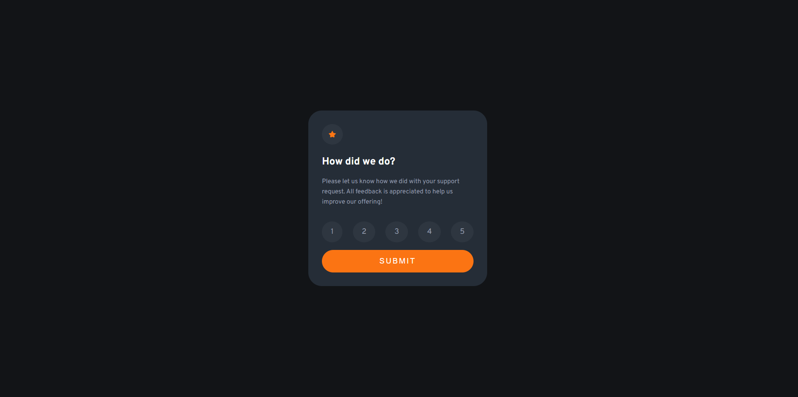
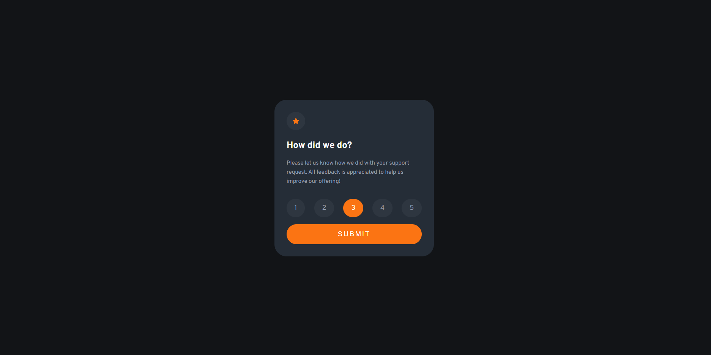
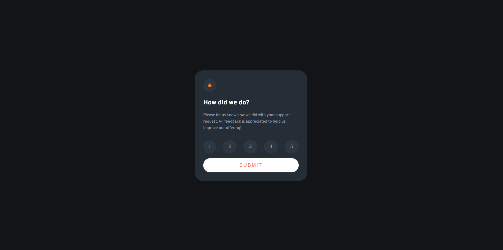
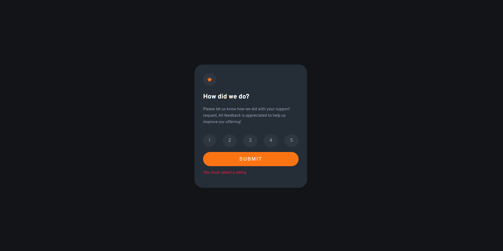

# Frontend Mentor - Interactive rating component solution

This is a solution to the [Interactive rating component challenge on Frontend Mentor](https://www.frontendmentor.io/challenges/interactive-rating-component-koxpeBUmI). Frontend Mentor challenges help you improve your coding skills by building realistic projects. 

## Table of contents

- [Overview](#overview)
  - [The challenge](#the-challenge)
  - [Screenshot](#screenshot)
  - [Links](#links)
- [My process](#my-process)
  - [Built with](#built-with)
  - [What I learned](#what-i-learned)
  - [Continued development](#continued-development)
- [Author](#author)

## Overview

### The challenge

Users should be able to:

- View the optimal layout for the app depending on their device's screen size
- See hover states for all interactive elements on the page
- Select and submit a number rating
- See the "Thank you" card state after submitting a rating

### Screenshot

#### Normal State

#### Hover State

#### Active States

#### Error message

### Links

- Live Site URL: [Click here](https://your-live-site-url.com)

## My process

### Built with

- Semantic HTML5 markup
- CSS custom properties
- Flexbox
- SASS Preprocessor
- JavaScript

### What I learned
I learned the basics of JavaScript and some basic functions that it gives you.

### Continued development

This is my first challenge and small project using JavaScript so I would like to keep learning and mastering more JavaScript and also keep mastering SASS and CSS Flexbox.

## Author

- Frontend Mentor - [@YaikaRace](https://www.frontendmentor.io/profile/yaikarace)
- YouTube Channel - [Yaika Race](https://www.youtube.com/c/yaikarace)
- GitHub - [YaikaRace](https://www.github.com/yaikarace)
